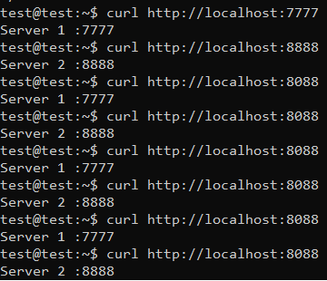
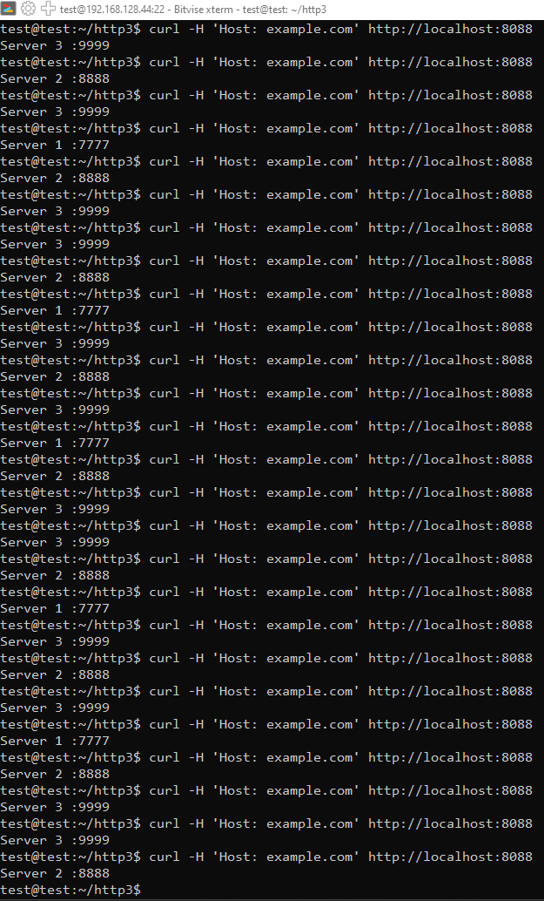

# Кластеризация и балансировка нагрузки

# Домашнее задание к занятию 2 «Кластеризация и балансировка нагрузки»
## Андреев Александр Вадимович

# Задание 1
### Запустите два simple python сервера на своей виртуальной машине на разных портах
### Установите и настройте HAProxy, воспользуйтесь материалами к лекции по ссылке
### Настройте балансировку Round-robin на 4 уровне.
### На проверку направьте конфигурационный файл haproxy, скриншоты, где видно перенаправление запросов на разные серверы при обращении к HAProxy.

[HAPROXY conf file](https://github.com/AndreevAleksandr/CandLB/blob/main/Conf_File/haproxy1.cfg "Конфигурационный файл HAPROXY")

		

# Задание 2
### Запустите три simple python сервера на своей виртуальной машине на разных портах
### Настройте балансировку Weighted Round Robin на 7 уровне, чтобы первый сервер имел вес 2, второй - 3, а третий - 4
### HAproxy должен балансировать только тот http-трафик, который адресован домену example.local
### На проверку направьте конфигурационный файл haproxy, скриншоты, где видно перенаправление запросов на разные серверы при обращении к HAProxy c использованием домена example.local и без него.

[HAPROXY conf file 2](https://github.com/AndreevAleksandr/CandLB/tree/main/Conf_File "Конфигурационный файл HAPROXY_2")

